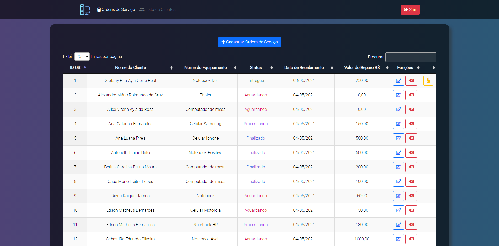

# Sobre

Este projeto foi desenvolvido no 1° semestre do curso de Bacharelado em Sistemas de Informação. Para a conclusão de uma proposta de projeto, realizada pela matéria de Jornada de Aprendizagem – Startup, Inovação e Tecnologia. 

O objetivo central deste projeto, é criar um sistema web de ordem de serviço, que consiga atender uma empresa que atua na assistência técnica de computadores e celulares. 
Para este projeto, foi utilizado uma empresa real como paramêtro para a concepção da ideia, ela concordou em fazer parte deste desenvolvimento acadêmico.

Sistema começou a ser desenvolvido no dia: 08/04/2021

Sistema desenvolvido por: Geovani Possenti

# Interface

